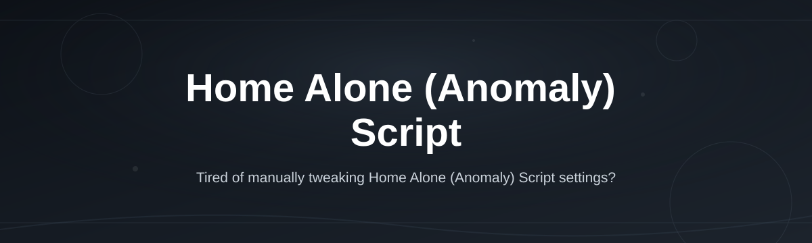
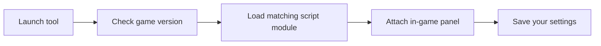

# home-alone-anomaly-script-hub

*A cleaner way to run the Home Alone (Anomaly) Script without digging through five Discord servers and a dozen dead pastebin links.*

## What this is

Home Alone (Anomaly) Script is a lightweight companion tool built for players of the *Home Alone (Anomaly)* Roblox experience — the horror-survival game where you're locked in a house with something that isn't supposed to be there. This hub packages the script into a single standalone download so you don't have to piece it together from forum threads, sketchy loaders, or outdated video tutorials that reference features which no longer exist.

The project exists because most script listings for this specific game go stale within a week — the game updates, the old script breaks, and the thread that shared it never gets touched again. This repo is maintained specifically to track those updates, note what changed, and keep a working version available with clear instructions on what it actually does before you run anything.

  

The button above opens the project landing page, where the current build is hosted for download.

## Who it is for

- Players who've been burned by outdated Home Alone (Anomaly) scripts that no longer match the current game version
- Roblox horror-game fans who want QoL utilities (ESP-style awareness, item tracking) without editing config files by hand
- Streamers who need a stable tool that won't crash mid-session on a live audience
- People new to the game who want to understand the anomaly mechanics faster while learning the map
- Anyone tired of re-downloading the "same" script from five different re-uploads with different malware wrapped around it

## What you can do

- **Track anomaly behavior patterns** so you can react before you're caught off guard
- **See item and objective locations** on the current map layout without alt-tabbing to a wiki
- **Adjust in-game settings** through a simple panel instead of hunting for console commands
- **Get update notifications** when the game patches and the script needs a refresh
- **Run it standalone** — no extra runtime, no dependency installer, just launch and go
- **Toggle features on or off** individually instead of an all-or-nothing switch
- **Check version compatibility** at a glance before you load into a match
- **Report broken features** directly through the landing page if something stops working after a game update

## Getting started

1. Open the landing page using the download button on this page.
2. Download the current build listed there.
3. Extract the files to a folder of your choice.
4. Run the launcher and follow the on-screen prompts.
5. Load into Home Alone (Anomaly) and confirm the overlay/panel appears.

## Requirements

- Windows 10 or 11 (64-bit)
- No additional runtime, toolchain, or compiler needed — it runs standalone
- A working Roblox installation with Home Alone (Anomaly) already installed
- Roughly 150 MB of free disk space

## How it works

1. The launcher checks the installed game version against the last known compatible build.
2. It loads the script module that matches that version.
3. An overlay panel attaches once you're in-game, exposing the available toggles.
4. Your chosen settings are saved locally so they persist between sessions.
5. If a mismatch is detected, the launcher flags it instead of loading a broken script silently.

## FAQ

**Is there a Home Alone (Anomaly) Script that still works after the latest update?**
Compatibility is tracked on the landing page for each build. If the current game version isn't listed as supported yet, hold off until an update lands rather than forcing an outdated version.

**Does this work on Mac or mobile?**
No. This build targets Windows 10/11 desktop only. There's no mobile or macOS version currently maintained.

**Will this get me banned from the game?**
Any third-party tool carries some risk in a multiplayer Roblox game. This project focuses on visibility and quality-of-life features rather than gameplay manipulation, but no outside script is entirely without risk — use your own judgment.

**Why does the panel not show up after I load in?**
Usually a version mismatch. Check the landing page for the latest compatible build and re-download if a patch was released recently.

**Is this the same as the script floating around on Discord?**
Possibly related in origin, but this repo maintains its own tested build with version tracking, so it's worth comparing before assuming they behave identically.

## Troubleshooting

- **Panel doesn't attach in-game:** Confirm your game build matches the version noted on the landing page; re-download if not.
- **Launcher won't open:** Right-click and run as administrator, and confirm Windows Defender or your antivirus isn't quarantining the executable.
- **Settings reset every session:** Make sure the tool has write permission to its own folder — running from a read-only or cloud-synced directory can block saving.
- **Game crashes on load:** Disable other overlay tools (Discord overlay, GPU overlays) that might conflict, then retry.

## License

Released under the [MIT License](LICENSE). This project is an independent fan tool and is not affiliated with, endorsed by, or created by the developers of Home Alone (Anomaly) or Roblox Corporation. Use it at your own discretion and in line with the game's terms of service.

  

